# 🏥 MediStock Core: Clinical Data Pipeline & ERP


## 🎯 Executive Summary

**MediStock Core** is a robust **ETL (Extract, Transform, Load)** pipeline and backend system designed to modernize legacy healthcare operations. 

The project addresses a critical business problem: transforming unstructured, inconsistent historical data (Excel spreadsheets) into a normalized, ACID-compliant **PostgreSQL Data Warehouse**. This system serves as the foundation for real-time inventory tracking, patient management, and business intelligence analytics.

---

## 🗺️ Architecture Overview

The system follows a modular architecture where data cleaning logic is decoupled from the ingestion layer. It utilizes a **"Taller" pattern** (utility workshop) to handle complex data transformation before loading it into the transactional database.

```mermaid
graph TD;
    A[📄 Raw Legacy Excel Data] -->|1. Ingestion| B(Pandas Staging Engine);
    B -->|2. Transformation Pipeline| C{Data Cleaning Logic};
    C -->|Schema Standardization| D[Strict Type Enforcement];
    C -->|Heuristics| E[Identity Reconstruction Map];
    C -->|NLP / Regex| F[Feature Extraction from Notes];
    F --> G[✅ Cleaned & Consolidated Data];
    G -->|3. Transactional Load| H[(PostgreSQL Warehouse)];
    H <-->|4. API Layer| I[Flask Backend API];
```



---

## 🛠️ Tech Stack & Engineering Decisions

| Component | Technology | Reasoning |
| :--- | :--- | :--- |
| **Language** | Python 3.10+ | Robust ecosystem for Data Engineering and Backend logic. |
| **ETL Engine** | Pandas / NumPy | Vectorized operations for high-speed data manipulation. |
| **Database** | PostgreSQL | Chosen for strict relational integrity, JSONB support, and advanced indexing capabilities. |
| **ORM** | SQLAlchemy | To manage database abstraction and secure transaction handling. |
| **Backend** | Flask | Lightweight framework for creating modular RESTful API endpoints. |

---

## 🧠 Core Business Logic & Algorithms

This project goes beyond simple data copying. It implements complex algorithms to recover and sanitize lost data:

### 1. Heuristic Identity Reconstruction
Legacy data often contains missing patient IDs. I implemented a **"Truth Mapping" algorithm** that correlates fuzzy name matches with historical records to backfill missing DNIs (National IDs), maximizing data retention rates.

### 2. Context-Aware Transaction Inference
Distinguishing between a "New Debt" and a "Payment" in unstructured text is difficult. The system uses **Negative Lookbehind Regex** to infer the financial context of a transaction based on unstructured operator notes.

### 3. Feature Extraction via Regex
Medical supplies (e.g., "Botox 50u", "Syringes 3ml") were buried in free-text fields. I built a **Regex Extraction Engine** to parse these strings into structured inventory items, enabling precise stock tracking.

---

## 📂 Project Structure

```bash
/clinica-prime-etl-pipeline
│
├── data/                  # Raw sensitive data (GitIgnored for security)
├── notebooks/
│   └── main.ipynb         # Orchestration: The command center for the ETL process
├── src/
│   ├── app/               # Flask Application Source
│   │   ├── models/        # SQLAlchemy ORM Models (Schema definition)
│   │   ├── routes/        # API Endpoints
│   │   └── utils/         # Helper functions
│   └── limpieza_utils.py  # The Toolkit: Advanced data cleaning functions
├── sql/                   # Raw SQL Scripts for complex queries and migrations
├── output/                # Cleaned datasets ready for BI tools
└── requirements.txt       # Dependency management
```

---

## 🚀 How to Run

### Prerequisites

* Python 3.10 or higher
* PostgreSQL installed locally or via Docker

### Installation

1.  **Clone the repository:**
    ```bash
    git clone https://github.com/MiguelAAR10/clinica-prime-etl-pipeline.git
    cd clinica-prime-etl-pipeline
    ```

2.  **Set up Virtual Environment:**
    ```bash
    python -m venv venv
    source venv/bin/activate  # On Windows: venv\Scripts\activate
    ```

3.  **Install Dependencies:**
    ```bash
    pip install -r requirements.txt
    ```

4.  **Configuration:**
    Create a `.env` file based on your Postgres credentials. Place raw `.xlsx` files in the `data/` directory.

5.  **Execute Pipeline:**
    Run the Jupyter Notebook in `notebooks/main.ipynb` to trigger the ETL process.

---

## 🔮 Roadmap & Future Improvements

* [ ] **Dockerization:** Containerize the entire application (API + DB) using Docker Compose.
* [ ] **CI/CD:** Implement GitHub Actions for automated testing.
* [ ] **Frontend:** Build a Streamlit Dashboard for real-time inventory visualization.
* [ ] **AI Integration:** Implement an LLM Agent (RAG) to query the database using natural language.

---


**Miguel Arias**
*Industrial Engineer | Data & Software Operations*
[LinkedIn](https://www.linkedin.com/in/tu-usuario) | [Portfolio](https://github.com/MiguelAAR10)
```
