# 🏥 MediStock Core: Clinical Data Pipeline & ERP

## 🎯 Executive Summary

**MediStock Core** is a robust **ETL (Extract, Transform, Load)** pipeline and backend system designed to modernize legacy healthcare operations. 

The project addresses a critical business problem: transforming unstructured, inconsistent historical data (Excel spreadsheets) into a normalized, ACID-compliant **PostgreSQL Data Warehouse**. This system serves as the foundation for real-time inventory tracking, patient management, and business intelligence analytics.

---

## 🗺️ Architecture Overview

The system follows a modular architecture where data cleaning logic is decoupled from the ingestion layer. It utilizes a **"Taller" pattern** (utility workshop) to handle complex data transformation before loading it into the transactional database.

```mermaid
graph TD;
    A[📄 Raw Legacy Excel Data] -->|1. Ingestion| B(Pandas Staging Engine);
    B -->|2. Transformation Pipeline| C{Data Cleaning Logic};
    C -->|Schema Standardization| D[Strict Type Enforcement];
    C -->|Heuristics| E[Identity Reconstruction Map];
    C -->|NLP / Regex| F[Feature Extraction from Notes];
    F --> G[✅ Cleaned & Consolidated Data];
    G -->|3. Transactional Load| H[(PostgreSQL Warehouse)];
    H <-->|4. API Layer| I[Flask Backend API];
```

